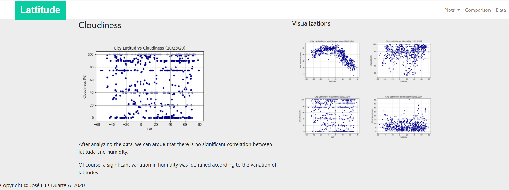
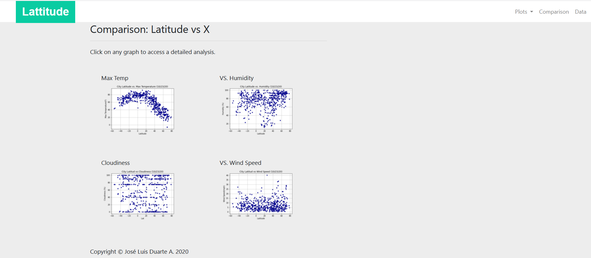

# web-Design-Challenge

## Web Design Homework - Web Visualization Dashboard (Latitude)

## Background

I created a dashboard showing off the analysis I've done in a past homework.

## Latitude - Latitude Analysis Dashboard with Attitude

For this homework I created a visualization dashboard website using visualizations I've created in a past assignment.  [weather data](Resources/cities.csv).

I created individual pages for each plot and a means by which we can navigate between them. These pages contain the visualizations and their corresponding explanations. Also have a landing page, a page where we can see a comparison of all of the plots, and another page where we can view the data used to build them.

### Website Specifications

The website consist of 7 pages total, including:

* A Landing Page containing:
  * An explanation of the project.
  * Links to each visualizations page.
  

* Four Visualization Pages, each with:
  * A descriptive title and heading tag.
  * The plot/visualization itself for the selected comparison.
  * A paragraph describing the plot and its significance.
    
    
    
    

* A Comparisons Page that:
  * Contains all of the visualizations on the same page so we can easily visually compare them.
      

* A Data Page that:
  * Displays a responsive table containing the data used in the visualizations.
      

The website have, at the top of every page, have a navigation menu that:

* Has the name of the site on the left of the nav which allows users to return to the landing page from any page.
* Contains a dropdown on the right of the navbar named "Plots" which provides links to each individual visualization page.
* Provides two more links on the right: "Comparisons" which links to the comparisons page, and "Data" which links to the data page.
    

### Screenshots

This section contains screenshots of each page that must be built, at varying screen widths.

#### Landing page

Large screen:

Small screen:



#### Comparisons page

Large screen:

Small screen:

#### Data page

Large screen:

Small screen:

#### Visualization pages

Large screen:

Small screen:

#### Navigation menu

Large screen:

Small screen:
